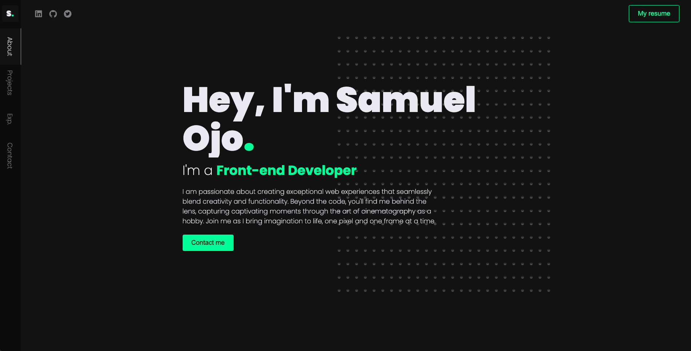
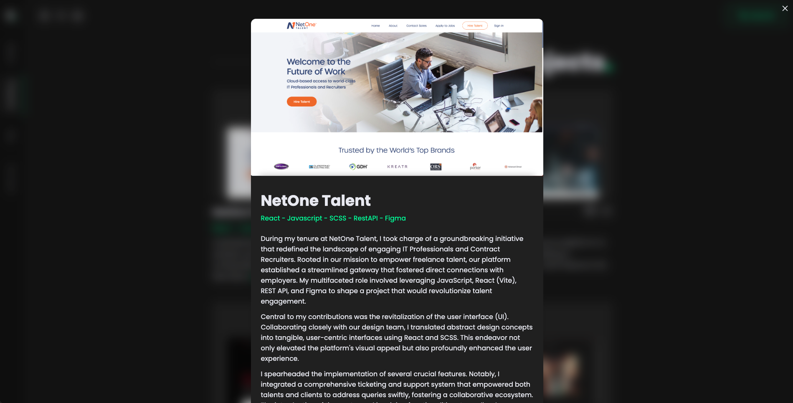

# Samuel Ojo Portfolio



## Introduction

Welcome to my portfolio project! This project showcases my skills as a frontend developer and my passion for creating captivating web experiences. The portfolio is built using [Next.js](https://nextjs.org/) for efficient and dynamic web development, [SCSS](https://sass-lang.com/) for styling, [TypeScript](https://www.typescriptlang.org/) for static typing, [Anime.js](https://animejs.com/) for animations, and [Framer Motion](https://www.framer.com/motion/) for interactive animations.

## Features

- **Next.js**: Leveraging the power of server-side rendering and React components for seamless navigation and performance.
- **SCSS**: Styling with the flexibility and maintainability of SCSS preprocessor.
- **TypeScript**: Enjoy the benefits of static typing and enhanced code integrity.
- **Anime.js**: Adding dynamic and engaging animations to various elements.
- **Framer Motion**: Creating interactive and delightful animations for enhanced user experience.
- **Responsive Design**: Ensuring a great user experience across various devices and screen sizes.
- **Project Showcase**: Highlighting my previous projects, skills, and accomplishments.
- **Contact Form**: Allowing visitors to get in touch with me directly from the portfolio.



## Getting Started

### Prerequisites

- Node.js and npm (Node Package Manager)

### Installation

1. Clone the repository:

   ```bash
   git clone https://github.com/greatsamist/samuelojo-portfolio.git
   ```

2. Navigate to the project directory:
   ```bash
   cd samuelojo-portfolio
   ```
3. Install the dependencies:
   ```bash
   npm install
   ```
4. Start the development server:
   ```bash
   npm run dev
   ```
5. Open your browser and navigate to http://localhost:3000 to see your portfolio live.

### Usage

Feel free to customize the project to make it your own. Update the content, add more projects, modify the styling, integrate additional animations, and experiment with TypeScript enhancements.

### License

This project is licensed under the MIT License.

### Contact

Connect with me:

- Portfolio: [Samuelojo.com](https://ojosamuel.com)
- LinkedIn: [@greatsamuelojo](https://www.linkedin.com/in/greatsamuelojo/)
- Twitter: [@greatsamuelojo](https://twitter.com/greatsamuelojo)

Feel free to reach out with any questions, suggestions, or collaboration opportunities!

Made with ❤️ by Samuel Ojo
